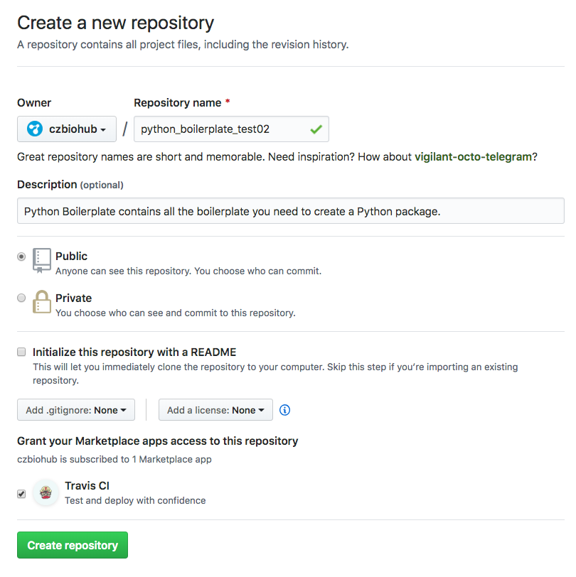
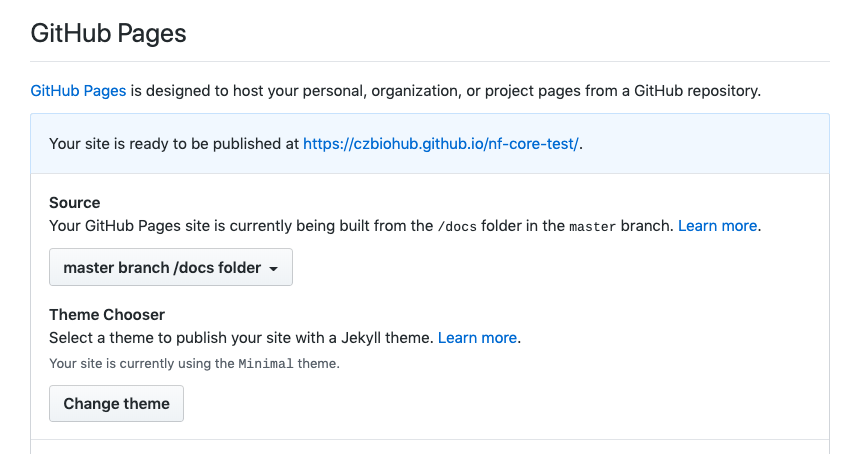
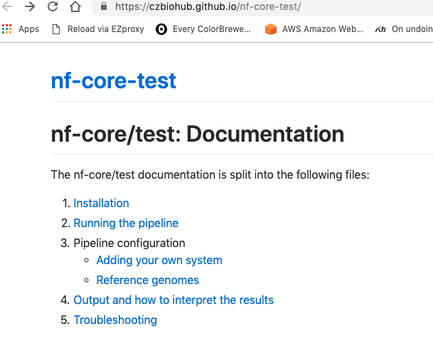

# nextflow-tutorial-2019
Materials for the Nextflow tutorial held at Biohub on April 11th, 2019

[TOC]: # "Table of Contents"


## Schedule

- 10am - 12pm - Learning
  - We will work through Nextflow's awesome [beginner tutorial](https://nextflow-io.github.io/nf-hack18/training.html) together
  - We'll focus on Sections 1-2 - "Installation" and "Simple Rna-Seq pipeline" in the morning
- 12pm - 1pm - Lunch (provided)
- 1pm - 5pm - Hackathon
  - Convert some of your own workflows into Nextflow
  - If you don't have anything ready yet, you can do the [more advanced](https://nextflow-io.github.io/nf-hack18/handson.html) Nextflow tutorial
  
  
## Setup and Installation

### Java via OpenJDK

Nextflow requires Java 8 or greater to be installed. Try this command:

```
java -version
```

This is what I see:

```
 Wed 10 Apr - 17:27  ~/code/nextflow-tutorial-2019   origin ☊ master ✔ 1☀ 
  java -version
java version "1.8.0_131"
Java(TM) SE Runtime Environment (build 1.8.0_131-b11)
Java HotSpot(TM) 64-Bit Server VM (build 25.131-b11, mixed mode)
```

This counts as 8 or greater because turns out that [1.8 = 8](https://docs.oracle.com/javase/1.5.0/docs/relnotes/version-5.0.html) in Java land.

If you have [homebrew](https://brew.sh/) installed, installing Java is a single command:

```
brew cask install java
```

### Nextflow

Once you have Java, you can install Nextflow with this command:

```
curl -s https://get.nextflow.io | bash 
```

This will download a binary executable file `nextflow` to your current directory. You probably want to move it to a binaries folder on your `$PATH`, e.g.

```
mv nextflow $HOME/bin
```

Test that it worked by running the `hello world` example:

```
nextflow run hello
```

The output should look something like this:

```
 ✘  Wed 10 Apr - 17:43  ~ 
  nextflow run hello
N E X T F L O W  ~  version 19.03.0-edge
Launching `nextflow-io/hello` [compassionate_galileo] - revision: a9012339ce [master]
executor >  local (4)
[ba/c421b7] process > sayHello [100%] 4 of 4 ✔
Completed at: 10-Apr-2019 17:44:40
Duration    : 724ms
CPU hours   : (a few seconds)
Succeeded   : 4
```


### Docker on your laptop

To enable testing your pipelines locally on your laptop, install [Docker](https://download.docker.com/mac/stable/Docker.dmg) (link downloads the Docker.dmg). This will let you make sure that the containers build correctly and run pipelines on your laptop, if they fit there.

Check that it worked with:

```
docker run hello-world
```

The output should look something like this:

```
 ✘  Wed 10 Apr - 17:43  ~/Downloads 
  docker run hello-world

Hello from Docker!
This message shows that your installation appears to be working correctly.

To generate this message, Docker took the following steps:
 1. The Docker client contacted the Docker daemon.
 2. The Docker daemon pulled the "hello-world" image from the Docker Hub.
    (amd64)
 3. The Docker daemon created a new container from that image which runs the
    executable that produces the output you are currently reading.
 4. The Docker daemon streamed that output to the Docker client, which sent it
    to your terminal.

To try something more ambitious, you can run an Ubuntu container with:
 $ docker run -it ubuntu bash

Share images, automate workflows, and more with a free Docker ID:
 https://cloud.docker.com/

For more examples and ideas, visit:
 https://docs.docker.com/engine/userguide/
```


### Atom editor + Nextflow syntax highlighting

[Atom](https://atom.io/) is a great editor from GitHub that supports many languages, including [Nextflow syntax highlighting](https://atom.io/packages/language-nextflow). There is also a [Sublime Text](https://packagecontrol.io/packages/nextflow) package (not as well supported) and a [Visual Studio](https://marketplace.visualstudio.com/itemdetails?itemName=nextflow.nextflow) package.


## Creating your own Nextflow Workflow

Use [cookiecutter-nextflow](https://github.com/czbiohub/cookiecutter-nextflow) to create a template folder with example nextflow workflows. Make sure to add your GitHub repo to [czbiohub/awesome-nextflow](https://github.com/czbiohub/awesome-nextflow)!

We'll use the nextflow-core (nf-core) developers excellent template. Please also check out their [pipeline creation guidelines](https://nf-co.re/adding_pipelines) for more info on writing good pipelines.


### 0. Install [`nf-core/tools`](https://github.com/nf-core/tools)

```
pip install nf-core
```


### 1. Create a pipeline template with `nf-core create`

Check out the documentation for `nf-core create`:

```
 Tue  2 Apr - 15:18  ~/code/nf-core-test   master ✔ 
  nf-core create --help

                                          ,--./,-.
          ___     __   __   __   ___     /,-._.--~\
    |\ | |__  __ /  ` /  \ |__) |__         }  {
    | \| |       \__, \__/ |  \ |___     \`-._,-`-,
                                          `._,._,'

Usage: nf-core create [OPTIONS]

  Create a new pipeline using the nf-core template

Options:
  -n, --name TEXT         The name of your new pipeline  [required]
  -d, --description TEXT  A short description of your pipeline  [required]
  --new-version TEXT      The initial version number to use
  --no-git                Do not initialise pipeline as new git repository
  -f, --force             Overwrite output directory if it already exists
  -o, --outdir TEXT       Output directory for new pipeline (default: pipeline
                          name)
  --help                  Show this message and exit.
```

Now we can see that the `--name` and `--description` fields are required. Here's an example

```
nf-core create --name pipelinename --description "pipeline description"
```


Here's the example output:
```
 Tue  2 Apr - 15:16  ~/code 
  nf-core create -n test -d "test of nf-core"

                                          ,--./,-.
          ___     __   __   __   ___     /,-._.--~\
    |\ | |__  __ /  ` /  \ |__) |__         }  {
    | \| |       \__, \__/ |  \ |___     \`-._,-`-,
                                          `._,._,'


INFO: Creating new nf-core pipeline: nf-core/test

INFO: Initialising pipeline git repository

INFO: Done. Remember to add a remote and push to GitHub:
  cd /Users/olgabot/code/nf-core-test
  git remote add origin git@github.com:USERNAME/REPO_NAME.git
  git push
```

Here's another example with a slightly more realistic name:

```
nf-core create --name largegenomeassembly --description "Assembly for large (1 gigabase+) genomes"
```

Note that pipeline names must be all lowercase and with no punctuation.


https://nf-co.re/adding_pipelines


### 2. Make a GitHub repository and push to GitHub

Make a [new czbiohub GitHub repository](https://github.com/organizations/czbiohub/repositories/new) with your pipeline name. Enable Travis-CI and don't add any .gitignore or README because the template has it. Also, make it public :)

Here's an example of the configuration:




### Test datasets

Nextflow developers have kindly curated test datasets in [nf-core/test-datasets](https://github.com/nf-core/test-datasets/). If that doesn't have what you want, aggressively downsample your data e.g. down to 1% of the input reads, or just one chromosome.


### 4. Enable Github Pages

Turning on GitHub pages will create a little website out of the `docs/` folder in the repository.

Go to the "Settings" tab on your repository and scroll down to "GitHub Pages." Here's an example configuration:



Here's a live example using their defaults: https://czbiohub.github.io/nf-core-test, and below is a static view:




### 5. Add your pipeline to [czbiohub/awesome-nextflow](https://github.com/czbiohub/awesome-nextflow)

We have our own internal Nextflow workflows enumerated at [czbiohub/awesome-nextflow](https://github.com/czbiohub/awesome-nextflow). There is also a more global [nextflow-io/awesome-nextflow](https://github.com/nextflow-io/awesome-nextflow) list of nextflow workflows you may want to check out before writing your own.

## Examples of Nextflow pipelines and patterns

### Toy examples: [Nextflow patterns](https://github.com/nextflow-io/patterns)

> A curated collections of Nextflow implementation patterns

These are toy/small examples showing Nextflow functionality for very basic
examples, from the Nextflow developers. This is certainly *somewhat* helpful for getting started but very limited in scope  for more complicated situations.
Here's some copy-pastable code for searching for example outputs. In this example, we're looking for how to make a program output values in addition to files by searching for `output:` and the 5 lines after it with `-A 5`.

```
git clone https://github.com/nextflow-io/patterns nextflow-io/patterns
cd nextflow-io/patterns
git grep -A 5 'output:' .
```

Here's the output:

```
collect-into-file.nf:  output:
collect-into-file.nf-  file 'file.fq' into unzipped_ch
collect-into-file.nf-  script:
collect-into-file.nf-  """
collect-into-file.nf-  < $x zcat > file.fq
collect-into-file.nf-  """
--
conditional-process.nf:  output:
conditional-process.nf-  file 'x.txt' into foo_ch
conditional-process.nf-  when:
conditional-process.nf-  !params.flag
conditional-process.nf-
conditional-process.nf-  script:
--
conditional-process.nf:  output:
conditional-process.nf-  file 'x.txt' into bar_ch
conditional-process.nf-  when:
conditional-process.nf-  params.flag
conditional-process.nf-
conditional-process.nf-  script:
... truncated ..
```

### Slightly more realistic: [`nextflow-demos`](https://github.com/stevekm/nextflow-demos)

> Example Nextflow pipelines and programming techniques

This is a curated list of example Nextflow pipelines maintained by non-Nextflow developers which can be helpful. Again, we're looking for ways to have multiple outputs from a single process.

```
git clone https://github.com/stevekm/nextflow-demos
cd nextflow-demos
git grep -A 5 'output:' .
```

Output:
```
LaTeX-aggregate/main.nf:    output:
LaTeX-aggregate/main.nf-    file("texput.pdf") into pdfs
LaTeX-aggregate/main.nf-
LaTeX-aggregate/main.nf-    script:
LaTeX-aggregate/main.nf-    """
LaTeX-aggregate/main.nf-    echo '\\shipout\\hbox{${word}}\\end' | pdftex
--
LaTeX-aggregate/main.nf:    output:
LaTeX-aggregate/main.nf-    file("report.pdf")
LaTeX-aggregate/main.nf-
LaTeX-aggregate/main.nf-    script:
LaTeX-aggregate/main.nf-    """
LaTeX-aggregate/main.nf-    pdflatex "${report}"
--
aggregate-db-report/people.nf:    output:
aggregate-db-report/people.nf-    set val(name), val(url), file("${output}") into people_pics
aggregate-db-report/people.nf-
aggregate-db-report/people.nf-    script:
aggregate-db-report/people.nf-    output = "${name}.jpg"
aggregate-db-report/people.nf-    """
... truncated ...
```


### Awesome Nextflow

There's a few places you can look for curated lists of Nextflow workflows as inspiration for your own workflows.

- [nextflow-io/awesome-nextflow](https://github.com/nextflow-io/awesome-nextflow)
- Internal Biohub workflows: [czbiohub/awesome-nextflow](https://github.com/czbiohub/awesome-nextflow)
